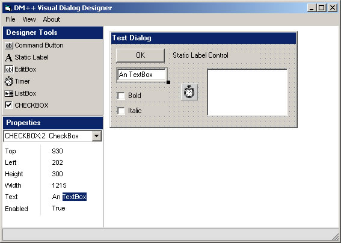

## DM Visual Dialog Designer

### Description

Hi, all. This is a project I been working on for the last day or so. That is a Visual Form designer. Note this is not a full version and was only made for my new scripting language but I thought I share it with you all. Anyway I hope you like it.
 
### More Info
 

             |
---                |---
**Submitted On**   |2005-02-09 14:14:02
**By**             |[dreamvb](https://github.com/Planet-Source-Code/PSCIndex/blob/master/ByAuthor/dreamvb.md)
**Level**          |Intermediate
**User Rating**    |5.0 (20 globes from 4 users)
**Compatibility**  |VB 6\.0
**Category**       |[Coding Standards](https://github.com/Planet-Source-Code/PSCIndex/blob/master/ByCategory/coding-standards__1-43.md)
**World**          |[Visual Basic](https://github.com/Planet-Source-Code/PSCIndex/blob/master/ByWorld/visual-basic.md)
**Archive File**   |[DM\_Visual\_1868663272005\.zip](https://github.com/Planet-Source-Code/dreamvb-dm-visual-dialog-designer__1-59673/archive/master.zip)

